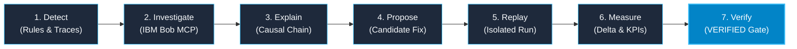

# TraceRCA

> **AI-Native Incident Investigation & Verified Remediation with IBM Bob**

TraceRCA is an AI-native incident investigation and verified remediation system powered by IBM Bob. It bridges the gap between observability symptoms and automated fixes by combining structured telemetry evidence, Model Context Protocol (MCP) tool integration, and deterministic replay verification. Instead of relying on untested LLM recommendations, TraceRCA executes candidate remediations against the live failure scenario to measure real improvements before marking an incident fix as verified.

[](https://www.typescriptlang.org/)
[](https://nodejs.org/)
[](https://nextjs.org/)
[](https://www.docker.com/)
[](https://modelcontextprotocol.io/)
[](https://www.ibm.com/)
[](https://www.ibm.com/)

---

## The Value Proposition

Most AI incident tools stop after suggesting a probable root cause or generating a text recommendation. 

**TraceRCA completes the lifecycle through empirical verification:**



> **TraceRCA does not mark a remediation as `VERIFIED` because an LLM thinks it should work. It replays the incident workload under the candidate configuration against the live provider condition and measures the result.**

---

## The Problem

- **Symptom Alerting**: Traditional monitoring alerts on symptoms (e.g., high latency or elevated error rates) without explaining what amplified the failure.
- **Manual Causality Reconstruction**: Engineers spend valuable MTTR manually stitching together distributed logs, HTTP status codes, and retry timelines.
- **Unverified AI Suggestions**: Generative AI tools propose plausible fixes based on training heuristics, but deploying untested configuration changes directly to production risks cascading outages.

---

## The TraceRCA Approach

1. **Structured Telemetry**: Fine-grained trace events track every lifecycle transition (`provider.requested`, `provider.response`, `router.retry_scheduled`, `router.fallback`).
2. **Deterministic Incident Engine**: Rule-based detection identifies systemic anomalies and builds structured incident records.
3. **Evidence-Grounded RCA**: IBM Bob queries live incident facts via MCP tools without hallucinating missing data.
4. **Constrained Remediation**: Bob targets the exact amplifier (e.g., excessive retries delaying fallback) rather than guessing external provider internals.
5. **Controlled Replay**: Replay Engine runs baseline vs candidate router configurations sequentially against the failing condition.
6. **Measured Verification**: Empirical metrics (latency reduction, retries saved) gate the final `VERIFIED REMEDIATION` verdict.

---

## Key Features

| Capability | Description |
|---|---|
| **Structured Telemetry** | Granular event tracing capturing status codes, attempts, latencies, and scheduled backoffs. |
| **Deterministic Detection** | Fast rule evaluation ($R_1: 429\text{s} \ge 2$, $R_2: \text{retries} \ge 2$, $R_3: \text{fallback} \land \text{latency} \ge 3\text{s}$). |
| **IBM Bob MCP Tools** | 8 native Model Context Protocol tools connecting Bob directly to TraceRCA APIs over stdio. |
| **Evidence Discipline** | Investigation skills strictly distinguish observed facts from causal reasoning. |
| **Causal Breakdown** | Clear separation of **Trigger** (initial failure), **Amplifier** (delays), and **Recovery** (fallback). |
| **Controlled Replay** | Isolated side-by-side replay of baseline vs candidate configurations under identical provider conditions. |
| **Empirical Verification** | Algorithmic verification gate requiring positive latency delta and preserved completion. |
| **Operator Dashboard** | Modern Next.js 16 UI with live telemetry counters, incident timelines, and replay diffs. |
| **Automated Demo Setup** | Single PowerShell script to recreate failure state, generate incident, and verify fix deterministically. |

---

## Architecture

TraceRCA separates operational routing, evidence ingestion, AI reasoning, and deterministic verification into distinct layers:

```mermaid
flowchart TD
    subgraph Clients ["Clients & Interfaces"]
        Operator["Operator / Judge"] -->|Browser| Dashboard["Dashboard\n(:3000 Next.js 16)"]
        UserTraffic["User / Demo Traffic"] -->|HTTP POST /chat| DemoApp["Demo AI App\n(:3001 Express Router)"]
    end

    subgraph ReasoningLayer ["Reasoning Layer (IBM Bob)"]
        Bob["IBM Bob Assistant\n(Investigation & Remediation Skills)"]
        BobMCP["TraceRCA MCP Server\n(services/bob-mcp - stdio)"]
        Bob -->|MCP Protocol| BobMCP
    end

    subgraph Gateway ["Gateway Plane"]
        API["TraceRCA API Gateway\n(:4004 Express)"]
    end

    subgraph EvidencePlane ["Evidence & Telemetry Plane"]
        IncidentEngine["Incident Engine\n(:4002 Express)\n- Rule Evaluator\n- Incident Store"]
    end

    subgraph VerificationPlane ["Verification Plane"]
        ReplayEngine["Replay Engine\n(:4003 Express)\n- Replay Executor\n- Metrics Comparator\n- Verification Gate"]
    end

    subgraph UpstreamProviders ["Upstream Providers"]
        Sim["Provider Simulator\n(:4001 Express)\n- Provider A (Degraded: 429 / Normal: 200)\n- Provider B (Reliable Fallback: 200)"]
    end

    Dashboard -->|HTTP REST| API
    BobMCP -->|HTTP REST| API

    API -->|GET /incidents| IncidentEngine
    API -->|POST /replay, GET /replays| ReplayEngine
    API -->|GET /telemetry| DemoApp

    DemoApp -->|1. Primary & Fallback Requests| Sim
    DemoApp -.->|2. Async Telemetry Ingest| IncidentEngine
    ReplayEngine -->|3. POST /replay-exec (Baseline & Candidate)| DemoApp

    classDef default fill:#0F172A,stroke:#334155,stroke-width:1px,color:#F1F5F9;
    classDef primary fill:#1E293B,stroke:#38BDF8,stroke-width:2px,color:#F8FAFC;
    class API,Bob,ReplayEngine,IncidentEngine,Dashboard,DemoApp primary;
```

> For deep architectural specifications, see [Detailed Architecture Documentation](docs/ARCHITECTURE.md).

---

## IBM Bob Integration

TraceRCA does not use IBM Bob as a generic text chat. Bob is equipped with domain-specific tools and custom investigative skills via the **Model Context Protocol (MCP)**.

```text
IBM Bob  ──(MCP over stdio)──>  services/bob-mcp  ──(HTTP REST)──>  tracerca-api (:4004)
```

### Available MCP Tools

| Tool Name | Description |
|---|---|
| `get_incidents` | List summary of all detected incidents. |
| `get_incident` | Retrieve full incident metadata, trigger rules, and quantitative impact metrics. |
| `get_incident_events` | Fetch chronological ordered telemetry timeline for root-cause analysis. |
| `get_incident_metrics` | Fetch computed quantitative metrics ($429\text{s}$, retries, latency, fallback provider). |
| `get_telemetry_summary` | Get system-wide telemetry counters. |
| `get_telemetry_events` | Query raw trace events by `requestId` or `traceId`. |
| `run_replay` | Execute live baseline vs candidate replay and return empirical comparison. |
| `get_replay` | Retrieve persisted replay record and verification status by ID. |

### Custom IBM Bob Skills

1. **Incident Investigation (`.bob/skills/tracerca-incident-investigation`)**:
   ```text
   /tracerca-incident-investigation <incident-id>
   ```
   - Queries `get_incident` → `get_incident_events` → `get_incident_metrics` → `get_telemetry_events`.
   - Reconstructs the exact causal structure: **Trigger** (Provider A 429), **Amplifier** (retry backoffs), **Recovery** (Provider B fallback), and **Impact** (overall latency).
   - Enforces evidence discipline: missing data is reported as missing, never hallucinated.

2. **Verified Remediation (`.bob/skills/tracerca-verified-remediation`)**:
   ```text
   /tracerca-verified-remediation <incident-id>
   ```
   - Derives baseline parameters from live incident events (`maxRetries=3, retryDelayMs=750`).
   - Formulates a constrained candidate fix targeting the amplifier (`maxRetries=1, retryDelayMs=750`).
   - Executes real replay via `run_replay`, evaluates before/after metrics, and outputs **`VERIFIED REMEDIATION`**.

> **Key Distinction**: IBM Bob performs reasoning and synthesis; TraceRCA services provide factual evidence and deterministic verification.

---

## Demo Scenario

The demo scenario models a cascading failure commonly encountered in multi-provider LLM applications:

```text
[Provider A Degraded: HTTP 429]
        ↓
Attempt 1: Provider A  ──>  HTTP 429
        ↓  (750ms backoff)
Attempt 2: Provider A  ──>  HTTP 429
        ↓  (750ms backoff)
Attempt 3: Provider A  ──>  HTTP 429
        ↓  (750ms backoff)
Attempt 4: Provider A  ──>  HTTP 429
        ↓
Fallback:  Provider B  ──>  HTTP 200 (Success)
```

- **Trigger**: Provider A returns repeated HTTP 429 responses.
- **Amplifier**: Application router executes 3 retries with 750ms backoff delays, adding substantial latency before attempting fallback.
- **Recovery**: Fallback to Provider B succeeds, completing the request.
- **Candidate Remediation**: Reduce retries from 3 to 1 before fallback.
- **Verification**: Replay confirms candidate preserves successful recovery while reducing request latency by shedding unnecessary retry delays.

*(Note: Exact latency measurements depend on system execution time and provider delay parameters).*

---

## From RCA to Verified Remediation

```text
Traditional AI Incident Tooling:
  Incident  ──>  LLM Interpretation  ──>  Unverified Recommendation (MTTR Risk)

TraceRCA Loop:
  Incident  ──>  Structured Evidence  ──>  Bob RCA  ──>  UNVERIFIED Candidate
                                                                ↓
  VERIFIED REMEDIATION  <──  Measured Comparison  <──  Controlled Replay
```

TraceRCA prevents speculative fixes from reaching production by requiring every candidate configuration to prove its benefit in a controlled replay run.

---

## Operator Dashboard

The Next.js 16 operator dashboard provides real-time visibility into the system:

- **Incident Overview**: Real-time incident list with severity badges, trigger conditions, and status.
- **Telemetry Counter Cards**: Live counts of total requests, provider 429s, retries, and fallbacks.
- **Incident Detail & Timeline**: Chronological event trace visualizing request flow from initial attempt to fallback.
- **Replay Verification Ledger**: Side-by-side baseline vs candidate metrics comparison with verified status indicator.

> Screenshot guidelines and asset definitions are documented in [`docs/screenshots/README.md`](docs/screenshots/README.md).

---

## Quick Start

### Prerequisites
- Docker & Docker Compose
- PowerShell (Windows / cross-platform)
- Node.js 20+ (for local development)

### 1. Launch the Stack

```powershell
.\scripts\start-demo.ps1
```
*This command starts all containers in the background and waits for the API gateway to pass health checks.*

### 2. Prepare Demo Data Deterministically

```powershell
.\scripts\prepare-demo.ps1
```

*Output summary:*
```text
Incident ID                : INC-001
Replay ID                  : RPL-001
Incident Latency           : 3620ms
Baseline Latency           : 3580ms
Candidate Latency          : 2040ms
Latency Improvement        : 43%
Retry Reduction            : 2 retries
Verified Status            : True

Dashboard URLs:
- Dashboard Overview         : http://localhost:3000
- Incident Detail            : http://localhost:3000/incidents/INC-001
- Replay Detail              : http://localhost:3000/replays/RPL-001
```

### 3. Run the Smoke Test Suite

```powershell
.\scripts\smoke-test.ps1
```

---

## Alternative: Manual Execution

```powershell
# Start all containers
docker compose up -d --build

# Inspect logs
docker compose logs -f tracerca-api
```

---

## Port Allocation

| Service | Port | Purpose |
|---|---|---|
| **Dashboard** | `3000` | Next.js operator console |
| **Demo AI App** | `3001` | LLM router and telemetry emitter |
| **Provider Simulator** | `4001` | Mocked upstream providers (A & B) |
| **Incident Engine** | `4002` | Ingest receiver, rule evaluator, and incident store |
| **Replay Engine** | `4003` | Deterministic replay executor and verifier |
| **TraceRCA API** | `4004` | Unified REST gateway |

---

## Project Structure

```text
TraceRCA/
├── .bob/                                      # IBM Bob integration
│   ├── mcp.json                               # Bob MCP configuration
│   └── skills/
│       ├── tracerca-incident-investigation/   # Bob RCA skill
│       └── tracerca-verified-remediation/     # Bob Replay & Verification skill
├── apps/
│   ├── dashboard/                             # Next.js 16 Web UI (:3000)
│   ├── demo-ai-app/                           # Express routing application (:3001)
│   └── tracerca-api/                          # Unified API Gateway (:4004)
├── services/
│   ├── bob-mcp/                               # MCP Server adapter (stdio)
│   ├── incident-engine/                       # Telemetry ingest & rule evaluator (:4002)
│   ├── provider-simulator/                    # Simulated LLM providers (:4001)
│   └── replay-engine/                         # Replay executor & verifier (:4003)
├── packages/
│   └── contracts/                             # Shared TypeScript types & interfaces
├── docs/
│   ├── ARCHITECTURE.md                        # Deep architectural specification
│   ├── DEMO_RUNBOOK.md                        # 3–5 minute judge demo walkthrough
│   └── screenshots/                           # Visual asset guidelines
├── scripts/
│   ├── prepare-demo.ps1                       # Deterministic demo preparation
│   ├── smoke-test.ps1                         # End-to-end smoke test suite
│   └── start-demo.ps1                         # Container startup & healthcheck
├── docker-compose.yml                         # Container composition
├── CONTRIBUTING.md                            # Contributor guidelines
└── README.md                                  # Landing documentation
```

---

## Technology Stack

| Layer | Technologies |
|---|---|
| **Languages** | TypeScript 5.4, JavaScript (ESM & CommonJS) |
| **Runtimes & Frameworks** | Node.js 20+, Express 4.19, Next.js 16.3, React 19 |
| **AI & Protocols** | IBM Bob 2.0, Model Context Protocol (MCP SDK 1.11), Zod |
| **Infrastructure** | Docker, Docker Compose, PowerShell |

---

## Design Principles

1. **Evidence Before Reasoning**: No AI conclusions without concrete, ordered telemetry.
2. **Deterministic Facts**: Incident detection and replay comparison are computed algorithmically.
3. **Reasoning Separated from Verification**: IBM Bob generates hypotheses and candidate fixes; TraceRCA Replay Engine independently verifies them.
4. **Zero Telemetry Fabrication**: Missing fields in traces are acknowledged as gaps rather than filled with assumptions.
5. **Replay Isolation**: Replay runs execute against isolated execution endpoints (`/replay-exec`) without polluting live telemetry streams.
6. **Measured Verification**: A remediation is only `VERIFIED` when empirical data demonstrates positive improvement while maintaining successful completion.

---

## Current Scope & Limitations

TraceRCA is a hackathon MVP designed to validate AI-driven incident investigation and replay verification:
- **Simulated Providers**: Upstream providers are simulated to provide reliable, repeatable failure scenarios without external third-party API dependencies.
- **In-Memory Storage**: Telemetry, incident records, and replay results are stored in memory; state is reset upon container recreation (use `prepare-demo.ps1` to re-seed).
- **Targeted Remediation Class**: The current verification engine targets retry/backoff reduction before fallback as its verified remediation class.
- **Controlled Replay Environment**: Replays execute against controlled demo instances rather than live production workloads.
- **No Automatic Deployment**: TraceRCA validates candidate configurations in isolated replays; it does not deploy modifications to live production clusters.

---

## Documentation Links

- [Detailed Architecture](docs/ARCHITECTURE.md)
- [Demo Runbook (3–5 Min Presentation)](docs/DEMO_RUNBOOK.md)
- [IBM Bob Skills Directory](.bob/skills/)
- [Bob MCP Configuration](.bob/mcp.json)
- [Automated Scripts](scripts/)
- [Contributor Guidelines](CONTRIBUTING.md)
- [Visual Assets Guide](docs/screenshots/README.md)

---

## IBM Bob 2.0 Hackathon

TraceRCA was built for the **IBM Bob 2.0 Hackathon** to demonstrate how AI agents can move beyond conversational RCA toward closed-loop, verified incident remediation. By pairing IBM Bob's analytical reasoning with MCP tool integration and deterministic replay verification, TraceRCA establishes a credible standard for autonomous SRE workflows.