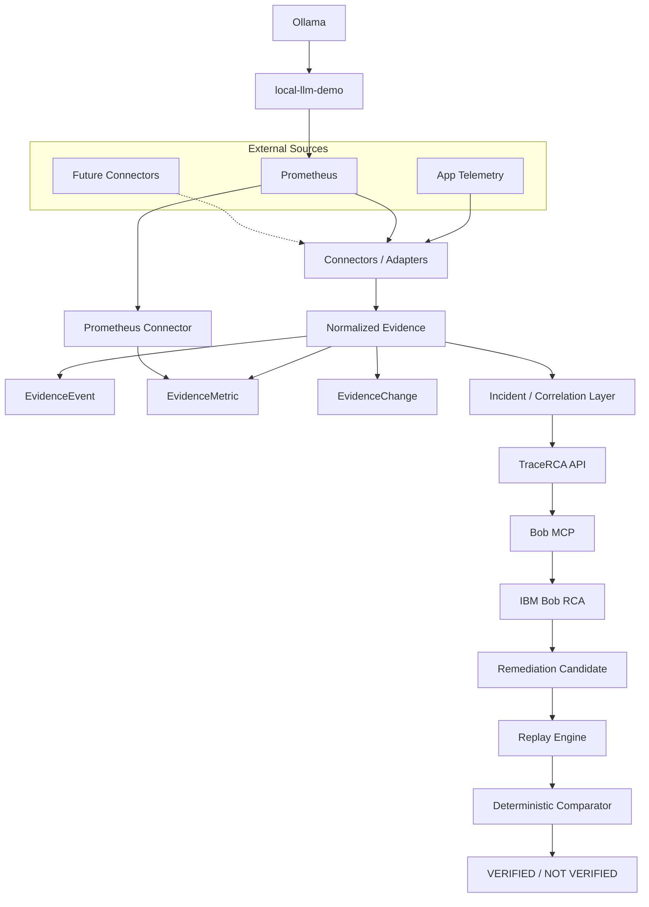

# TraceRCA

**TraceRCA is an AI-native production incident investigation and verified remediation system powered by IBM Bob.**

TraceRCA gathers operational evidence from connected systems, normalizes and correlates it, lets Bob perform evidence-grounded root-cause analysis, proposes remediation candidates, and verifies them where controlled replay or another validation mechanism is available.

## The Problem

Modern AI systems can fail across the application, model provider, local model runtime, retry router, infrastructure, database, deployment, and observability layers. Evidence is fragmented across those systems, and logs alone rarely provide a complete causal picture.

Operators must distinguish observed facts from plausible explanations, reconstruct timelines, identify missing evidence, and avoid deploying an attractive but untested recommendation during an incident.

## Why Not Just Ask ChatGPT / Claude / Codex?

A general coding agent usually sees repository code, pasted logs, and context explicitly supplied by a user. That can help reasoning, but it does not create a systematic production investigation workflow.

TraceRCA adds:

- systematic operational evidence collection;
- normalized evidence contracts and provenance;
- service, trace, request, model, environment, and run correlation;
- ordered incident timelines;
- structured IBM Bob access through MCP tools;
- evidence-grounded RCA rules that expose hypotheses and missing evidence;
- deterministic remediation verification where a controlled validator exists.

The reasoning engine can evolve. TraceRCA owns the production evidence, correlation, investigation, and verification workflow.

## How It Works


```mermaid
flowchart TD
    subgraph Sources[External Sources]
        App[App Telemetry]
        Prom[Prometheus]
        Future[Future Connectors]
    end

    App --> Adapters[Connectors / Adapters]
    Prom --> Adapters
    Future -.-> Adapters
    Adapters --> Evidence[Normalized Evidence]
    Evidence --> Event[EvidenceEvent]
    Evidence --> Metric[EvidenceMetric]
    Evidence --> Change[EvidenceChange]
    Evidence --> Correlation[Incident / Correlation Layer]
    Correlation --> API[TraceRCA API]
    API --> MCP[Bob MCP]
    MCP --> Bob[IBM Bob RCA]

    Bob --> Candidate[Remediation Candidate]
    Candidate --> Replay[Replay Engine]
    Replay --> Comparator[Deterministic Comparator]
    Comparator --> Verdict[VERIFIED / NOT VERIFIED]

    Ollama[Ollama] --> LocalDemo[local-llm-demo]
    LocalDemo --> Prom
    Prom --> PromConnector[Prometheus Connector]
    PromConnector --> Metric
```

The reasoning and verification paths are deliberately separate: Bob interprets evidence and proposes candidates; deterministic services own verification truth.

## IBM Bob Integration

IBM Bob connects through the Model Context Protocol over stdio. The TraceRCA MCP adapter translates Bob tool calls into API requests without requiring pasted logs.

```text
IBM Bob -> MCP (stdio) -> services/bob-mcp -> TraceRCA API -> evidence and verification services
```

Implemented MCP tools:

- `get_incidents`
- `get_incident`
- `get_incident_events`
- `get_incident_metrics`
- `get_telemetry_summary`
- `get_telemetry_events`
- `run_replay`
- `get_replay`
- `query_evidence`
- `get_incident_evidence`
- `get_metric_window`

Bob skills:

- `/tracerca-incident-investigation` reconstructs an incident from ordered facts.
- `/tracerca-verified-remediation` derives a constrained candidate and invokes the real replay workflow.
- `/tracerca-evidence-rca` investigates arbitrary normalized events, metrics, and changes while separating observations, supported relationships, hypotheses, unsupported conclusions, and missing evidence.

## Demo Story A — Verified Incident

```text
Provider A degradation
  -> repeated HTTP 429
  -> retries and backoff
  -> Provider B fallback
  -> increased request latency
  -> Bob RCA
  -> reduce maxRetries candidate
  -> controlled replay
  -> VERIFIED
```

The provider scenario is controlled and deterministic. Bob identifies the returned failure as the trigger, retry policy as the amplifier, fallback as recovery, and latency as impact. Replay compares the observed baseline with the candidate. Only the replay engine can return `verified: true`.

## Demo Story B — Real AI Observability

```text
Real Ollama request
  -> local-llm-demo metrics
  -> Prometheus
  -> TraceRCA Prometheus connector
  -> normalized EvidenceMetric
  -> same-run comparison using run_id
  -> Bob evidence-grounded RCA
```

This is real external observability data from a locally running Ollama model. Each demo invocation generates a unique `run_id`; normal and high-context measurements are compared only when they share that identifier. The RCA reports what the current evidence shows—even when a larger prompt is faster—and does not invent GPU, CPU, queue, or memory explanations.

The Ollama investigation is currently `NOT YET VERIFIED`: it demonstrates real evidence collection and disciplined RCA, not deterministic remediation verification.

## Evidence Model

TraceRCA normalizes operational records into:

- `EvidenceEvent` for discrete occurrences such as responses, retries, and fallback;
- `EvidenceMetric` for numeric observations such as latency and token counts;
- `EvidenceChange` for deployments, configuration changes, and other state transitions.

Every record includes source metadata, provenance, assertion level, timestamp, and flexible correlation fields. Correlation can include service, environment, trace, request, model, and custom keys such as the Ollama demo run ID. The generic repository supports bounded queries across all three evidence kinds.

## Verification Philosophy

Bob proposes reasoning and remediation candidates. Deterministic services decide verification truth.

A candidate is `VERIFIED` only when actual replay, canary, or equivalent validation evidence meets the configured predicate. Bob cannot turn an untested suggestion or a failed experiment into a verified remediation. When evidence is incomplete, the RCA reports missing evidence and avoids unsupported causal claims.

## Current Scope

Implemented now:

- deterministic Provider A/B incident detection and timeline;
- evidence-grounded IBM Bob investigation;
- retry-reduction remediation candidate and controlled replay;
- deterministic `VERIFIED` / `NOT VERIFIED` result;
- generic normalized evidence repository and query API;
- real Prometheus/Ollama evidence integration with `run_id` correlation;
- generic evidence RCA skill;
- judge-facing dashboard for both demo stories.

Future extensions, not current capabilities:

- Kubernetes and OpenTelemetry connectors;
- database, deployment, and Git evidence;
- GPU and richer runtime telemetry;
- canary validation;
- persistent evidence storage.

TraceRCA is a hackathon MVP. It does not automatically deploy production changes and is not a replacement for an observability platform.

## Quick Start

Prerequisites:

- Docker Desktop with Docker Compose;
- Node.js 20+ and npm for the Bob MCP build;
- PowerShell.

Start and prepare the deterministic incident story:

```powershell
.\scripts\start-demo.ps1
.\scripts\reset-demo.ps1
.\scripts\prepare-demo.ps1
```

`start-demo.ps1` invokes `setup-mcp.ps1` automatically when the Bob MCP build is missing or stale.

For the real local-model story, install and start Ollama, pull a model, and configure separate host and container URLs:

```powershell
$env:OLLAMA_HOST_URL = "http://localhost:11434"
$env:OLLAMA_URL = "http://host.docker.internal:11434"
$env:OLLAMA_MODEL = "<installed-model>"
.\scripts\prometheus-ollama-demo.ps1
```

The script never downloads a model. If `OLLAMA_MODEL` is omitted, it selects the first model returned by the local Ollama `/api/tags` endpoint.

Validate a prepared submission environment without changing its state:

```powershell
.\scripts\final-demo-check.ps1
```

## Dashboard URLs

- Overview: http://localhost:3000
- Incident: http://localhost:3000/incidents/INC-001
- Local LLM evidence: http://localhost:3000/evidence/local-llm
- Replay: http://localhost:3000/replays/RPL-001

## Repository Map

```text
.bob/skills/                 IBM Bob investigation and remediation skills
apps/dashboard/              Next.js judge-facing dashboard
apps/demo-ai-app/            Provider routing and telemetry demo
apps/local-llm-demo/         Real Ollama workload and Prometheus metrics
apps/tracerca-api/            Unified API gateway
services/bob-mcp/            IBM Bob MCP adapter
services/incident-engine/    Evidence repository, connector, detector, incidents
services/replay-engine/      Controlled replay and deterministic comparator
services/provider-simulator/ Deterministic Provider A/B scenario
config/prometheus/           Prometheus scrape configuration
scripts/                     Setup, demos, acceptance, and final checks
docs/                        Architecture and judge documentation
```

## Documentation

- [4–5 minute demo guide](docs/DEMO_GUIDE.md)
- [Judge FAQ](docs/JUDGE_FAQ.md)
- [Detailed architecture](docs/ARCHITECTURE.md)
- [Historical evidence-model design](docs/task4-evidence-model-design.md)

## Submission Position

TraceRCA demonstrates a practical boundary between agent reasoning and operational truth: fragmented signals become normalized evidence, IBM Bob turns that evidence into a disciplined investigation, and independent validation decides whether a remediation is verified.
